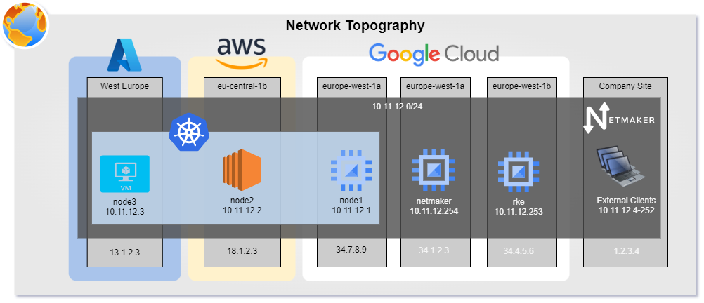

# kagnostic
This repository contains Ansible playbooks to create a cloud agnostic k8s setup using Netmaker and Rancher Kubernetes Engine.
## Architecture
This will provide the basis for a HA multi-regional kubernetes cluster which can look like this: 

This repository has a so called `kagnostic` example inventory which will create the infrastructure shown in the diagram above.

The k8s cluster will consist of 3 nodes, each one from a different cloud provider. So it's most likely, that each of these nodes will be located in a different data-center. 
## Cloud Agnostic
The example in this repository gives you an idea of how this setup may work. You are welcome to use any cloud provider or on-premise instance you want as long as it fullfills the [Prerequisites](#prerequisistes).
## Advantages
* No Vendor lock-in - You can always add/replace any node by any vendor you like
* Highly available setup possible - Since you can spread your cluster over different geographical regions, even entire data-centers may fail without interrupting your services (if configured appropriately)
* No data privacy issues... If you have concerns on how cloud vendors handle the data going over their cloud, you can simply spin up a cluster on your premises or in housings you trust.
## Disadavantages
Despite being a reliably working setup, you should also consider, that it has some downsides too:
* Maintenance -> Despite being relatively easy in setting up, such a self-hosted cluster is work you won't end up having when using solutions from cloud vendors ([Azure AKS](https://azure.microsoft.com/products/kubernetes-service/), [Amazon EKS](https://aws.amazon.com/eks/), [GKE](https://cloud.google.com/kubernetes-engine)). In this setup you must maintain additional layers of complexity: The Netmaker Network and setup of Kubernetes.
* Passing on best-in-breed services -> Since a lot of people worked on these cloud based services, they most likely already faced issues you will stumble upon which may cause issues in the long run. These problems can be of various nature like security, performance, scalability, you name it.
* Internet traffic -> since kubernetes nodes in general talk a lot to each other there will be a considerable amount of internet traffic you have to keep an eye out for when using cloud providers. 
# Prerequisites
* Access to a DNS provider for your `example.com` url. You must be able to create DNS entries which will point to your computing instances.
* At least 4 computing instances, each with a static public ip address. It doesn't matter if or in which cloud they are located. Just mind the [Firewall Settings](#firewall-settings)! Also, you need ssh access to each instance, since Ansible relies on ssh here. I guess you can use any linux distro you like. However, everything here is tested only on Ubuntu 22.04.
* A local linux distribution (on Windows you can use a WSL2 Ubuntu distro)
* [Install Ansible](https://docs.ansible.com/ansible/latest/installation_guide/intro_installation.html) (tested with 6.7.0) on your local machine. 

# Firewall Settings
If in the cloud(s) or not, you will have to adjust your firewall settings for each computing instance accordingly. 
Here's an example list of how to configure firewalls in general on different cloud providers:
* [GCP](https://cloud.google.com/vpc/docs/using-firewalls?hl=en) -> Create some Firewall Rules with a network tag and add this respective tag to your instance
* [Azure](https://learn.microsoft.com/en-us/azure/virtual-machines/windows/nsg-quickstart-portal#create-a-network-security-group) -> tbd....
* [AWS](https://docs.aws.amazon.com/vpc/latest/userguide/VPC_SecurityGroups.html) -> create a security group with all the rules required and assign it to your instance
* [UFW](https://www.digitalocean.com/community/tutorials/how-to-setup-a-firewall-with-ufw-on-an-ubuntu-and-debian-cloud-server) -> if you are on bare metal, UFW may be the easiest way to go. (Though I am using it myself it feels like it fails some time... but I wasn't able to pinpoint my problems with it yet). 

Now, let's get down to business!
## Netmaker
Open ports 443 (and optionally 80) and at least one UDP port starting at `51821`. 
You'll need 1 UDP port per netmaker network you intend to have. 
For reference see [Netmaker Documentation](https://docs.netmaker.org/quick-start.html#open-firewall).
> **Security Advice**: I would highly recommend opening port 443(and 80) only to IPs you know instead of all (0.0.0.0/0). A password leak may cause serious issues if the firewall doesn't block bad actors here. For example: One could just silently create an external client which may intrude via the Netmaker VPN. So my advice: Open 443/80 only for your local(static) IP and the IPs of all actors in this scenario (netmaker, rke, the nodes)
## Nodes 
* 443 for all (0.0.0.0/0) -> since you most likely want to expose some kind of https Service to the world
* 22 at least for your personal/company IP (required for all Ansible setup operations)
* All TCP traffic from Netmaker Network (e.g. `network.address_range` in [inventory file](inventory/kagnostic.yaml)). Will look something like `Anywhere on nm-{{ network.id }}  ALLOW   {{ network.address_range }}`). If you want to make it more secure you should narrow it down to each port used between each kubernetes node and to external clients (like your devs), just in case a bad actor got access to your netmaker network!

# Usage
Here, we assume all computing instances (1 for netmaker, 1 for rke, 3 for the cluster) are already setup including firewall rules. 
If not done yet, please refer to the [prerequisites](#prerequisites).
> All Ansible playbooks are designed to be idempotent. So you can also use them to update your setup (like new Netmaker or Kubernetes version or additon of a Node)

## Roles and plugins
First, you need to install all required Ansible roles and plugins required for the playbooks to run properly:
Just execute:
```shell
./util/install-prerequisites.sh
```

## Create/Adapt Inventory File
You need to either create a new inventory file or adapt [inventory/kagnostic.yaml](inventory/kagnostic.yaml) to your needs.
## Netmaker Setup
This one usually has to be executed only once and it only requires the `all` and the `netmaker` section in the inventory file to complete successfully.

It will setup/update your Netmaker instance and can be executed in 1 of 2 ways:
```shell
# 1. method: When using the kagnostic.yaml inventory file
./util/setup-netmaker.sh

# 2. method: When using a custom inventory file
ANSIBLE_CONFIG=$(dirname "$0")/ansible.cfg ansible-playbook playbooks/setup-netmaker.yaml -i inventory/<customFile>.yaml
```

## Networking Setup
Like above, you can either use the simple script 
```
./util/setup-networking.sh
``` 
when using the inventory file `inventory/kagnostic.yaml` or type in a custom ansible commmand (see [Netmaker Setup](#netmaker-setup) to get the idea).

This one will setup the desired network defined in your inventory file and connect all nodes as well as rke and netmaker in one mesh network.

## Kubernetes Setup
To get the cluster up and running as defined in your inventory, you can simply run
```
./util/setup-k8s.sh
``` 
When using a different inventory file than the one provided, you need to type the ansible command yourself (see [Netmaker Setup](#netmaker-setup) to get the idea).

> This one also download the `kubeconfig` file to the root of this directory. It'll be named <clusterName>.kubeconfig

## Merge kubeconfig
With the script `merge-kubeconfig.sh` you can merge the freshly created kubeconfig into your existing one.
Simply type:
```shell
./merge-kubeconfig.sh <clusterName>.kubeconfig
```
This will also change the currently used context and test the connection with `kubectl get nodes`

# tl;dr
Now everything without explanation in short. 
> DON'T use this short example for production! This is just a proof-of-concept to try yourself.
## Prerequisites
### Domain
You need a domain and set a wild card DNS entry like:
`*.netmaker.<yourdomain>`
### Computing
For an HA-setup you need at least the following computing resources:
* 2 micro computing instances (>= 1cpu, 2gb mem) -> netmaker and rke
* 3 medium computing instances (>= 2cpu, 4gb mem) -> 3 k8s nodes
> **Each one requires a static public IP address and ssh access from your local machine**
### Firewall
You need to open the following ports:
#### Netmaker
* 80 and 443 for every (including self) computing instance IP and your local one
* 22 for your IP
* 51821/UDP for 0.0.0.0/0
#### RKE
* 22 for your IP
#### Nodes
* 443 for 0.0.0.0/0
* All Ports for 10.11.12.0/24 
### Inventory File
Replace  the following values in the inventory file [inventory/kagnostic.yaml](inventory/kagnostic.yaml):
* `ansible_host` and `ansible_user` for **each of the 5 hosts** 
* `netmaker.base_domain` with your Netmaker address like `netmaker.<yourdomain>`
* `netmaker.letsencrypt_email` with a valid email address


## Usage
You're all set! Just execute:
```shell
./bootstrap-it-all.sh
```
If you want to merge the freshly downloaded `kubeconfig` simply execute
```
./merge-kubeconfig.sh kagnostic-cluster
```

# Open Topics
* [ ] Create YT Video tutorial
* [ ] Test with nodes farther away from each other to check if cluster behaves correctly
* [ ] DNS Load Balancing for HA setups
* [ ] It would be cleaner to integrate netmaker related templates directly from the makers instead of customizing them into jinja files. Have to talk to @afeiszli to align here.
* [ ] RKE is most likely also executable locally, when being an external client (netmaker-wise). Have to test this scenario!
* [ ] Cover storage using EBS
* [ ] Cover MetalLB via Netmaker IPs
* [ ] Cover Secret Encryption using SOPS
* [ ] Cover GitOps Integration wit Flux
* [ ] Cover k8s "user management"
* [ ] Bonus: Explain on how to create VMs (including firewall settings) on different cloud providers